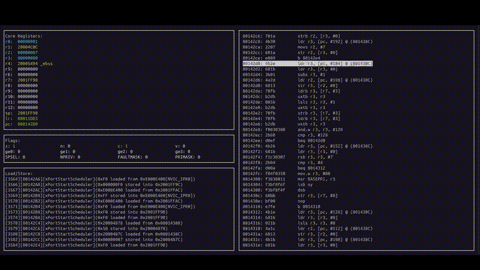

# Vortex-M (Visual Cortex-M)
Vortex-M is a full-featured soft-core implementation of the Cortex-M architecture.

It is intended for educational and artistic purposes.

The project supports the core Thumb2 instruction set.

<div align="center">
  <br>
</div>

## Build and Run
Vortex-M is written in DLang and built using dub. 

From the src subdirectory run:

```
  dub run -c=cortexm -- [path_to_elf_file] [soc] [addr] 
```
- [path_to_elf_file] : valid path to an elf file.
- [soc] : one of either "stm32" (for stm32f4X) or "nrf" (for nrf52X).
- [addr] : (optional) run to this address on start-up.

## Samples
You can get started by running one of the samples. 

For example, to run the blink LED FreeRTOS sample, from the src subdirectroy run:

```
  dub run -c=cortexm -- ../samples/stm32f4/freertos_blink.elf stm32
```
<div align="center">
  <br>
</div>

## Tracing

Vortex-M can be used for tracing. 

Three main log files are generated in src/logs:
```
load_store_log.txt
pc_log.txt
stack_log.txt
```

```
[3733][8014222][SVC_Handler]
[3734][8014226][SVC_Handler]
[3735][801422A][SVC_Handler]
[3736][80005A4][LedTask2]
[3737][80005A6][LedTask2]
[3738][80005A8][LedTask2]
[3739][80005AA][LedTask2]
[3740][80005AC][LedTask2]
[3741][80005AE][LedTask2]
[3742][80005B0][LedTask2]
[3743][8004CE2][HAL_GPIO_TogglePin]
[3744][8004CE4][HAL_GPIO_TogglePin]
[3745][8004CE6][HAL_GPIO_TogglePin]
[3746][8004CE8][HAL_GPIO_TogglePin]
```


