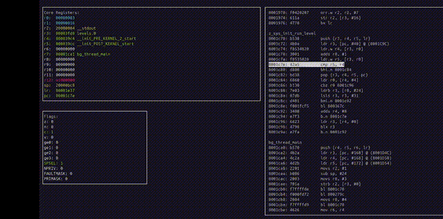

I am Stig of the Hexadecimal Dump. Feed me objdump files and I will make them execute.

<div align="center">
  <br>
</div>

# Cortex-M
The intended goal of this project is to implement a fully-featured soft-core version of a Cortex-M core.

<div align="center">
  <br>
</div>

## Thumb-2
Cortex-M always runs in Thumb-2 mode. 
### Opcodes

Opcode without a "32" in the name denote 16-bit instructions:

<!-- Non-_32 opcodes -->
<table width="100%">
  <tr>
    <td>adc_reg</td><td>add_high_reg_1</td><td>add_high_reg_2</td><td>add_imm_3</td>
  </tr>
  <tr>
    <td>add_imm_8</td><td>add_lo_reg</td><td>add_reg</td><td>add_sp</td>
  </tr>
  <tr>
    <td>add_sp_t1</td><td>add_sp_t2</td><td>adr</td><td>and_reg</td>
  </tr>
  <tr>
    <td>asr_imm</td><td>b_cond</td><td>blx</td><td>bx</td>
  </tr>
  <tr>
    <td>cmp_br_nz</td><td>cmp_br_z</td><td>cmp_high_1</td><td>cmp_high_2</td>
  </tr>
  <tr>
    <td>cmp_imm</td><td>cmp_reg</td><td>cps</td><td>if_then</td>
  </tr>
  <tr>
    <td>ld_rex</td><td>ldr_imm</td><td>ldr_pool</td><td>ldr_reg</td>
  </tr>
  <tr>
    <td>ldr_sp</td><td>ldrb_imm</td><td>ldrb_reg</td><td>ldrh_imm</td>
  </tr>
  <tr>
    <td>lor_reg</td><td>lsl_imm</td><td>lsl_reg</td><td>lsr_imm</td>
  </tr>
  <tr>
    <td>lsr_reg</td><td>mov_high_1</td><td>mov_high_2</td><td>mov_high_reg</td>
  </tr>
  <tr>
    <td>mov_imm</td><td>mov_lo</td><td>negs</td><td>nop</td>
  </tr>
  <tr>
    <td>rev</td><td>str_imm</td><td>str_sp</td><td>str_reg</td>
  </tr>
  <tr>
    <td>str_rex</td><td>strb_imm</td><td>strb_reg</td><td>strh_imm</td>
  </tr>
  <tr>
    <td>strh_reg</td><td>sub_imm_3</td><td>sub_imm_8</td><td>sub_reg</td>
  </tr>
  <tr>
    <td>sub_sp</td><td>svc</td><td>tst</td><td></td>
  </tr>
</table>

Opcodes with a "32" in the name denote 32-bit instructions:

<!-- _32 and _32_t* opcodes -->
<table width="100%">
  <tr>
    <td>adc_imm_32</td><td>adc_reg_32</td><td>add_32</td><td>add_imm_32</td>
  </tr>
  <tr>
    <td>add_reg_32</td><td>adr_32</td><td>and_imm_32</td><td>and_reg_32</td>
  </tr>
  <tr>
    <td>asr_imm_32</td><td>asr_reg_32</td><td>b_32</td><td>b_cond_32</td>
  </tr>
  <tr>
    <td>b_uncond_32</td><td>bfc_32</td><td>bfi_32</td><td>bic_imm_32</td>
  </tr>
  <tr>
    <td>bic_reg_32</td><td>bl_32</td><td>clz_32</td><td>cmn_32</td>
  </tr>
  <tr>
    <td>cmn_imm_32</td><td>cmn_reg_32</td><td>cmp_imm_32</td><td>cmp_reg_32</td>
  </tr>
  <tr>
    <td>dmb_32</td><td>dsb_32</td><td>eor_imm_32</td><td>isb_32</td>
  </tr>
  <tr>
    <td>ldh_32</td><td>ldmdb_32</td><td>ldmia_32</td><td>ldr_imm_32</td>
  </tr>
  <tr>
    <td>ldr_imm_32_t3</td><td>ldr_imm_32_t4</td><td>ldr_lit_32</td><td>ldr_reg_32</td>
  </tr>
  <tr>
    <td>ldr_sh_32</td><td>ldrb_32</td><td>ldrb_imm_32_t2</td><td>ldrb_imm_32_t3</td>
  </tr>
  <tr>
    <td>ldrb_reg_32</td><td>ldrd_imm_32</td><td>ldrbt_32</td><td>ldrt_32</td>
  </tr>
  <tr>
    <td>ldrsb_32</td><td>ldrsb_imm_32_t1</td><td>ldrsb_imm_32_t2</td><td>ldrsbt_32</td>
  </tr>
  <tr>
    <td>ldrsb_reg_32</td><td>lsl_imm_32</td><td>lsl_reg_32</td><td>lsr_imm_32</td>
  </tr>
  <tr>
    <td>lsr_reg_32</td><td>mla_32</td><td>mls_32</td><td>mov_imm_32_t2</td>
  </tr>
  <tr>
    <td>mov_reg_32</td><td>movt_32</td><td>mrs_32</td><td>msr_32</td>
  </tr>
  <tr>
    <td>mul_32</td><td>mvn_imm_32</td><td>mvn_reg_32</td><td>nop_32</td>
  </tr>
  <tr>
    <td>orn_32</td><td>orn_imm_32</td><td>orn_reg_32</td><td>orr_32</td>
  </tr>
  <tr>
    <td>orr_imm_32</td><td>orr_reg_32</td><td>pld_32</td><td>pld_imm_32</td>
  </tr>
  <tr>
    <td>pld_reg_32</td><td>pop_mult_reg_32</td><td>push_mult_reg_32</td><td>qadd_32</td>
  </tr>
  <tr>
    <td>qdadd_32</td><td>qdsub_32</td><td>qsub_32</td><td>rbit_32</td>
  </tr>
  <tr>
    <td>rev_16_32</td><td>rev_32</td><td>revsh_32</td><td>ror_32</td>
  </tr>
  <tr>
    <td>ror_imm_32</td><td>ror_reg_32</td><td>rrx_32</td><td>sbc_imm_32</td>
  </tr>
  <tr>
    <td>sbc_reg_32</td><td>sbfx_32</td><td>sel_32</td><td>stmb_32</td>
  </tr>
  <tr>
    <td>stmia_32</td><td>str_imm_32_t3</td><td>str_imm_32_t4</td><td>str_reg_32</td>
  </tr>
  <tr>
    <td>strb_imm_32_t2</td><td>strb_imm_32_t3</td><td>strb_reg_32</td><td>strd_32</td>
  </tr>
  <tr>
    <td>strh_imm_32_t2</td><td>strh_imm_32_t3</td><td>strh_reg_32</td><td>sub_imm_32</td>
  </tr>
  <tr>
    <td>sub_reg_32</td><td>sxtab_16_32</td><td>sxtab_32</td><td>sxtah_32</td>
  </tr>
  <tr>
    <td>sxtb16_32</td><td>sxtb_32</td><td>teq_imm_32</td><td>tst_imm_32</td>
  </tr>
  <tr>
    <td>tst_reg_32</td><td>uadd8_32</td><td>ubfx_32</td><td>udiv_32</td>
  </tr>
  <tr>
    <td>umull_32</td><td>uxtab_16_32</td><td>uxtab_32</td><td>uxtah_32</td>
  </tr>
  <tr>
    <td>uxtb16_32</td><td>uxtb_32</td><td>uxth_32</td><td></td>
  </tr>
</table>

Many instructions have "immediate versions" and "register versions". For example, **orr_imm_32** has one register operand and one immediate operand, where as **orr_reg_32** has two register operands.

Some instructions might only have a 16-bit version (eg **svc**), some might only have a 32-bit version (eg **uxtb_32**), some might have both a 16-bit version and a 32-bit version (eg **adc_reg/adc_reg_32**).

Some instructions might have more than one 16-bit version or more than one 32-bit version. For example, **add_imm_3** is a 16-bit add instruction that encodes one of its operands as a 3-bit immediate, where as **add_imm_8** is the same but with the immediate encoded in 8 bits instead of 3. 

In the case of 32-bit instructions, "t*" denotes a specific encoding. For example, **strb_imm_32_t2** uses certain default values for flags that allow it to use more bits to encode the immediate (12 bits in total). **strb_imm_32_t3** encodes the flags explicitly, so it only has 8 bits to store its immediate.

### Instructions
Thumb-2 instructions can be either 16 or 32-bit. These are modelled in Stig like this:
```code
struct instr_16 {
	uint addr;
	opcode op;
	reg rd;
	reg rm;
	reg rn;
    reg rm;
	reg rt;
	uint imm;
	int offset;
	condition cond;
	reg[] reg_list = null;
	bool set_flags;
	ubyte first_cond;
	ubyte mask;
	bool enable;
	bool affect_pri;
	bool affect_fault;
}
```
- **addr:** every instruction has an address that is loaded into the program counter
- **opcode:** every instruction has an opcode that identifes its type
- **rd:** destination register
- **rn:** first source register
- **rm:** second source register
- **imm:** immediate value
- **offet:** used in jumps/branches
- **rt:** target register, used in load and store operations. In the case of store, it holds the value to be stored, in the case of load, it recieves the loaded value
- **cond:** condition used in branching
- **reg_list:** used in push and pop of multiple registers
- **first_cond/mask:** used in the if-then instruction only
- **enable/affet_pri/affect_fault:** used in the cps insturciton only

```code
struct instr_32 {
	opcode op;
	reg rd;
	reg rn;
	reg rm;
	reg rt;
	shift_type shift_t;
	uint imm;
	ubyte shift_n;
	int offset;
	reg[] reg_list;
	uint ls_bit;
	uint width;
	uint ms_bit;
	reg rd_hi;
	reg rd_lo;
	reg rt_2;
	reg ra;
	condition cond;
	bool wback;
	bool add;
	bool index;
	ubyte mask;
	special_reg spec_reg;
	bool set_flags;
}
```
- **shift_t:** used in bit-shifts or rotations to denote the type of bit-shift or rotation
- **shift_n:** the number of bit positions to shift or rotate
- **ls_bit/ms_bit/width:** used in **unsigned bit-field extract** and **bit-field clear**
- **rd_hi/rd_lo:** used in instructions that need two destination registers (eg multiply)
- **ra:** used in **multiply-accumulate** and **multiply-subtract** to store the addend
- **wback:** true if the address of a load or store should be written back to the target register
- **add:** true if the immediate in a load or store should be added to the base address to derive the offset address, false if it should be subracted
- **index:** false if the immediate in a load or store is disregarded when calculating the offset address
- **spec_reg**: used in the **msr** and **mrs** insturctions to denote the special register to be read or written to
- **set_flags**: true if the result of the operation should affect CPU flags
